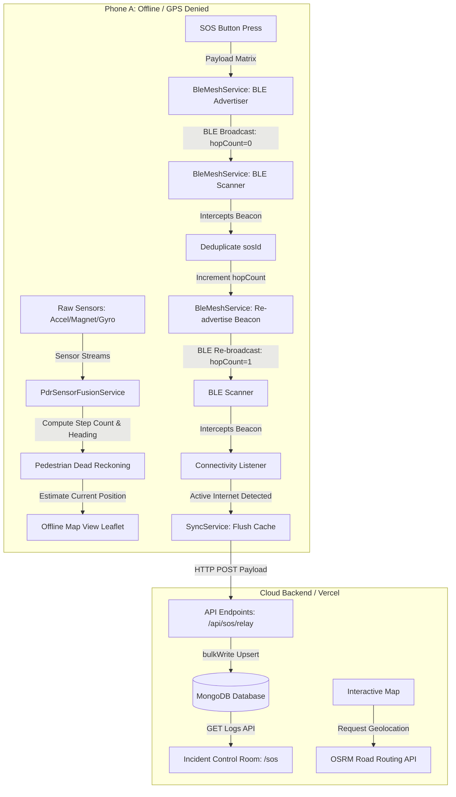

# TrailGuide: Hybrid Off-Grid Sensor-Fusion & BLE Mesh Rescue Coordination Engine
An end-to-end off-grid tracking and incident response system designed for campus navigation and remote emergency search-and-rescue. The system integrates a battery-efficient **Flutter Mobile Client** (running sensor-fusion dead reckoning and BLE mesh networks) with a **Next.js Web Portal** (providing GPS routing, multi-angle vector explore routes, and an interactive MongoDB SOS command center).

---

## 🗺️ System Architecture



---

## 📱 Mobile Client Engine (`trailguide_app`)
Located under: [`trailguide_app/`](file:///c:/Users/kanna/OneDrive/Documents/SEM_7_PROJECT/trailguide_app)

The mobile client is engineered in Flutter (Dart) to function completely off-grid with zero cellular connection or Wi-Fi.

### 1. Pedestrian Dead Reckoning (PDR) & Sensor Fusion
- **File**: [`lib/services/pdr_sensor_fusion_service.dart`](file:///C:/Users/kanna/OneDrive/Documents/SEM_7_PROJECT/trailguide_app/lib/services/pdr_sensor_fusion_service.dart)
- **Sensor Hookups**: Listens to accelerometer, user accelerometer, magnetometer, and gyroscope streams from `sensors_plus`.
- **Peak-Detection Step Counting**: Computes high-pass filtered accelerometer magnitude vector $||a|| = \sqrt{x^2 + y^2 + z^2}$ and processes peaks to identify step boundaries.
- **Tilt-Compensated Heading**: Combines accelerometer gravity metrics with magnetometer vector headings to compute a true yaw direction (bearing) independent of phone tilt.
- **PDR Coordinate Propagation**: Every detected step moves the hiker by an estimated step length $S_l$ in the direction of the calculated bearing $\theta$:
  $$Lat_{new} = Lat_{prev} + \frac{S_l \cdot \cos(\theta)}{R_{earth}}$$
  $$Lng_{new} = Lng_{prev} + \frac{S_l \cdot \sin(\theta)}{R_{earth} \cdot \cos(Lat_{prev})}$$

### 2. BLE Mesh Ad-Hoc Network
- **File**: [`lib/services/ble_mesh_service.dart`](file:///C:/Users/kanna/OneDrive/Documents/SEM_7_PROJECT/trailguide_app/lib/services/ble_mesh_service.dart)
- **Modes**:
  - **SOS Dispatcher Mode**: Encodes coordinate payloads, sender ID, timestamp, and hopcounts into a compressed BLE advertisement byte payload and broadcasts it.
  - **Relay Node Mode**: Scans in the background for active TrailGuide BLE signals. Upon finding a distress packet, it checks the local database; if it's a new incident, it increments `hopCount` and re-advertises the packet to extend the mesh range.
- **Payload Compression**: Encodes latitude/longitude coordinates and structural telemetry into compact hexadecimal BLE strings to fit within standard BLE payload limits.

### 3. Asynchronous Hive Cache & Sync Gateway
- **Files**:
  - [`lib/services/database_service.dart`](file:///C:/Users/kanna/OneDrive/Documents/SEM_7_PROJECT/trailguide_app/lib/services/database_service.dart)
  - [`lib/services/sync_service.dart`](file:///C:/Users/kanna/OneDrive/Documents/SEM_7_PROJECT/trailguide_app/lib/services/sync_service.dart)
- **Offline Storage**: Uses Hive boxes (`emergency_alerts` and `cached_maps`) to save logs and vector layouts locally. Box accesses are guarded by `Hive.isBoxOpen` to prevent concurrency crashes.
- **Internet Sync Pipeline**: Listens to active internet connections via `connectivity_plus`. When internet is restored, it flushes un-synced payloads from Hive to the remote backend (`https://trail-guide-pearl.vercel.app/api/sos/relay`) via HTTP POST and marks them as synced.

### 4. Interactive GeoJSON Vector Blueprint Map
- **File**: [`lib/screens/offline_map_view_screen.dart`](file:///C:/Users/kanna/OneDrive/Documents/SEM_7_PROJECT/trailguide_app/lib/screens/offline_map_view_screen.dart)
- **Features**: Parses GeoJSON features directly to draw 10 campus landmarks (Point geometries) and 9 campus walkways (LineString geometries) on a vector map canvas. Fully integrated with a floating red circular SOS button to trigger mesh dispatches instantly.

---

## 🌐 Web Portal Dashboard (`trail-guide`)
Located under: [`trail-guide/`](file:///c:/Users/kanna/OneDrive/Documents/SEM_7_PROJECT/trail-guide)

The portal is a Next.js server-side framework built using Tailwind CSS v4 and React 19.

### 1. Dynamic Map Routing & Geolocation
- **File**: [`app/components/InteractiveMap.js`](file:///c:/Users/kanna/OneDrive/Documents/SEM_7_PROJECT/trail-guide/app/components/InteractiveMap.js)
- **Features**: Requests user browser geolocation coordinates. On approval:
  - Adds a cyan user beacon and zoom-fits the map window to encompass both the user and Sri Eshwar College.
  - Queries the Open Source Routing Machine (OSRM) driving API to draw a green road route connecting the locations.
  - Gracefully falls back to a straight dashed line if OSRM queries fail, or local walking contours if geolocation is denied.

### 2. Incident Control Room Dashboard
- **File**: [`app/sos/page.js`](file:///c:/Users/kanna/OneDrive/Documents/SEM_7_PROJECT/trail-guide/app/sos/page.js)
- **Map View**: Uses [`SosControlMap.js`](file:///c:/Users/kanna/OneDrive/Documents/SEM_7_PROJECT/trail-guide/app/components/SosControlMap.js) to display all received MongoDB alerts on a dark map overlay. Markers are color-coded (Red = Active, Amber = Acknowledged, Green = Resolved) and pulse in real-time.
- **Incidents Logs Panel**: Lists detailed entries for incoming distress signals, including device IDs, coordinates, altitude logs, hops, and timestamps.
- **Operator Workflows**: Allows dispatchers to change alert states. Selecting a card reveals action buttons to **Acknowledge**, **Resolve**, or **Re-open** incidents, updating MongoDB.
- **Automatic Polling**: Refreshes data automatically every 5 seconds to load incoming BLE packets.
- **DNS Troubleshooting Banner**: Detects MongoDB server failures (like SRV connection blocking on local networks) and displays a warning banner recommending Google DNS (`8.8.8.8`) or Cloudflare DNS (`1.1.1.1`).

### 3. Backend Mongoose & API Endpoints
- **Mongoose Model**: [`models/EmergencyAlert.js`](file:///c:/Users/kanna/OneDrive/Documents/SEM_7_PROJECT/trail-guide/models/EmergencyAlert.js)
  Contains schemas for `sosId`, `senderDeviceId`, `relayDeviceId`, `location` (index type `2dsphere` for geographic distance calculation), `altitude`, `hopCount`, `timestamp`, and `status`.
- **API Endpoints**:
  - `GET/PUT` [`app/api/sos/route.js`](file:///c:/Users/kanna/OneDrive/Documents/SEM_7_PROJECT/trail-guide/app/api/sos/route.js): Returns all log entries; updates individual distress statuses.
  - `GET` [`app/api/sos/active/route.js`](file:///c:/Users/kanna/OneDrive/Documents/SEM_7_PROJECT/trail-guide/app/api/sos/active/route.js): Returns active distress records. Supports spherical radius filters (`lat`, `lng`, `radiusInKm`).
  - `POST` [`app/api/sos/relay/route.js`](file:///c:/Users/kanna/OneDrive/Documents/SEM_7_PROJECT/trail-guide/app/api/sos/relay/route.js): API endpoint for mobile gateway node uploads. Performs bulk-write deduplication on `sosId` and upserts records.

---

## 🛠️ Configuration & Secrets

### Web App (`.env.local` or environment variables)
```env
MONGODB_URI=mongodb+srv://<username>:<password>@cluster0.3fzbv.mongodb.net/trailguide?retryWrites=true&w=majority
API_KEY=your_secure_mesh_auth_token_here
```

### Mobile App (`pubspec.yaml` assets)
Ensure background cover assets are properly registered:
```yaml
flutter:
  assets:
    - images/tree.png
```

---

## 🔍 Troubleshooting Guide

1. **MongoDB Connection Failures (`ECONNREFUSED` / SRV DNS block)**:
   - **Reason**: Many ISP, local office, or college network routers block Mongo DNS SRV `_mongodb._tcp` queries.
   - **Resolution**: Update the computer's network settings to override default DNS:
     - Set Primary DNS to `8.8.8.8` (Google) or `1.1.1.1` (Cloudflare).
     - Flush DNS cache (`ipconfig /flushdns`) and restart the dev server (`npm run dev`).
2. **Hive Database Errors (`Box not found`)**:
   - **Reason**: Caused by trying to load a box database synchronously before it has finished opening.
   - **Resolution**: Standardize on the async check pattern before reading:
     ```dart
     final Box box = Hive.isBoxOpen('box_name')
         ? Hive.box('box_name')
         : await Hive.openBox('box_name');
     ```
3. **No GPS Fix indoors**:
   - **Reason**: Heavy concrete blocks satellite signals.
   - **Resolution**: Move outdoors, enable Wi-Fi / location services assistance, or rely on the Pedestrian Dead Reckoning (PDR) sensor algorithm fallback built into the client map interface.
