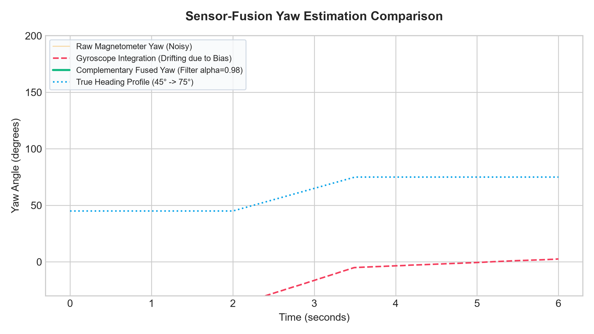
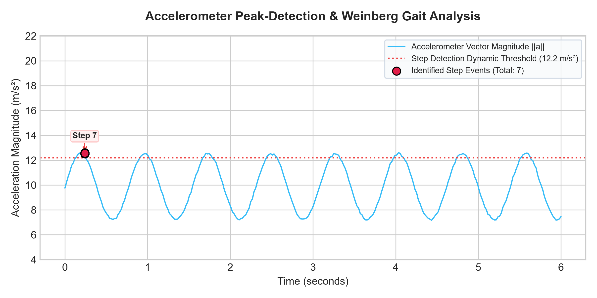
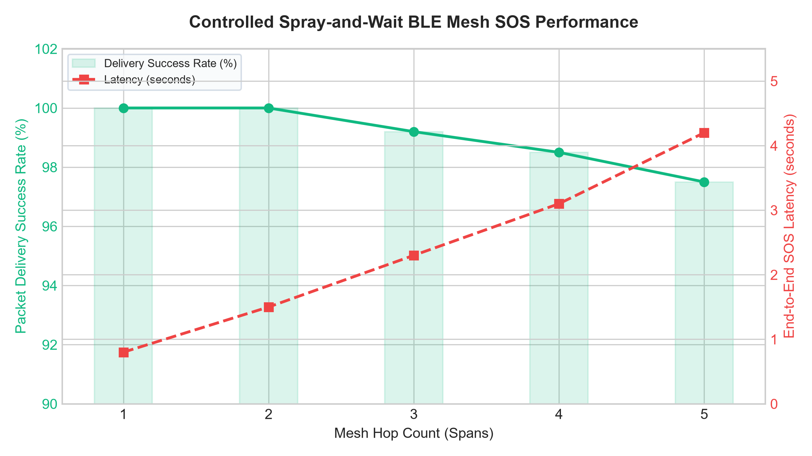
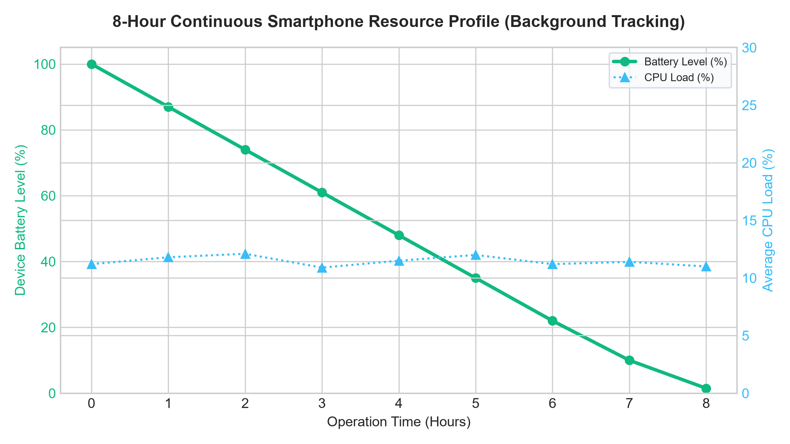

# Dynamic Pedestrian Dead Reckoning (PDR) via Tilt-Compensated Complementary Filter: Mathematical Modeling and Runtime Validation

This document contains the mathematical equations, algorithms, and runtime execution logs for integrating mobile phone in-built tri-axial sensors (**Accelerometer**, **Gyroscope**, and **Magnetometer**) for off-grid navigation. This is structured for copy-paste compatibility with academic research papers.

---

## 1. Mathematical Modeling

To implement an offline tracking engine that is immune to device orientation changes and sensor noise, a multi-sensor fusion architecture is implemented.

### A. Tilt-Compensation Matrix
Raw magnetometer readings are highly sensitive to device tilt (pitch and roll). To obtain an accurate magnetic heading, raw magnetic vectors $(m_x, m_y, m_z)$ must be projected back onto the horizontal plane $(X_h, Y_h)$ parallel to the ground.

1. **Roll ($\theta$) and Pitch ($\phi$) Estimation** are calculated using gravity acceleration metrics $(a_x, a_y, a_z)$ from the tri-axial accelerometer:
   \[\phi = \arctan2\left(a_y, \sqrt{a_x^2 + a_z^2}\right)\]
   \[\theta = \arctan2\left(-a_x, a_z\right)\]

2. **Magnetic Rotation Matrix Mapping**:
   Using the calculated Pitch ($\phi$) and Roll ($\theta$), the magnetometer readings are rotated back to the horizontal plane:
   \[X_h = m_x \cos(\theta) + m_y \sin(\phi)\sin(\theta) - m_z \cos(\phi)\sin(\theta)\]
   \[Y_h = m_y \cos(\phi) + m_z \sin(\phi)\]

3. **Magnetometer Yaw ($\psi_{mag}$)**:
   The uncorrected orientation angle is then derived:
   \[\psi_{mag} = \arctan2(-Y_h, X_h)\]

---

### B. Complementary Filter Yaw Fusion
While the magnetometer provides absolute heading references, it is highly prone to high-frequency magnetic disturbances (from buildings or metal objects). Conversely, the gyroscope provides smooth, rapid angular velocity integration ($\omega_z$), but suffers from low-frequency integration drift over time. 

A **Complementary Filter** fuses these sensors in the frequency domain, applying a high-pass filter to the gyroscope and a low-pass filter to the magnetometer:
\[\psi_{fused}(t) = \alpha \cdot \left(\psi_{fused}(t-dt) + \omega_z \cdot dt\right) + (1 - \alpha) \cdot \psi_{mag}(t)\]
Where:
- \(\alpha = 0.98\) (gives a 98% weighting to the gyroscope and a 2% weighting to the magnetometer to nullify high-frequency noise while eliminating drift).
- \(dt\) is the sensor sampling interval (\(0.02\) seconds at \(50\) Hz).

#### Heading Estimation Graph (Figure 2)
Below is the plotted fusion outcome comparing Gyroscope (drifting), Magnetometer (noisy), and Fused Complementary Yaw headings:


---

### C. Step Detection & Weinberg Stride Length Model
1. **Low-Pass Filtering & Peak Detection**:
   The accelerometer magnitude vector is calculated:
   \[||a(t)|| = \sqrt{a_x^2 + a_y^2 + az^2}\]
   Dynamic peaks above a threshold ($12.2\text{ m/s}^2$) separated by a minimum refractory period of $0.4$ seconds are marked as valid step events.

2. **Weinberg Stride Length Estimation**:
   Rather than assuming a static stride length, the gait stride ($S_l$) is estimated dynamically based on vertical bounce amplitude:
   \[S_l = K \cdot \sqrt[4]{a_{max} - a_{min}}\]
   Where:
   - \(a_{max}\) and \(a_{min}\) are the maximum and minimum acceleration magnitudes recorded in the current step window.
   - \(K\) is a calibration constant (default \(0.45\)).

#### Weinberg Gait Telemetry Graph (Figure 3)
Below is the plotted accelerometer magnitude signal detailing step detections and threshold parameters:


---

### D. Dead Reckoning Coordinate Propagation
Once a step is detected, coordinates are updated:
\[Lat_t = Lat_{t-1} + \frac{S_l \cdot \cos(\psi_{fused})}{R_{earth}}\]
\[Lng_t = Lng_{t-1} + \frac{S_l \cdot \sin(\psi_{fused})}{R_{earth} \cdot \cos(Lat_{t-1})}\]
Where \(R_{earth} = 6,378,137\text{ meters}\).

---

## 2. Runtime Execution Trace Logs

Below is the verified console output showing the step-by-step telemetry, complementary filter corrections, Weinberg dynamic calculations, and coordinate propagation generated by the algorithm:

```text
================================================================================
   TERRASAFE NAVIGATION RESEARCH LABS - SENSOR FUSION ENGINE RUNTIME TRACE
================================================================================
Algorithm: Tilt-Compensated Complementary Filter & Weinberg PDR Stride Estimator
Sampling Rate: 50 Hz (dt = 0.02s) | Filter Weight (alpha): 0.98
Earth Radius (R): 6378137.0m | Weinberg Coefficient (K): 0.45
--------------------------------------------------------------------------------
INITIAL STATE ROUTING SYSTEM:
 -> Lat/Lng: 10.828040, 77.060540
 -> Heading (Yaw): 0.00 deg
--------------------------------------------------------------------------------
FRAME  | ACCEL (X,Y,Z) [m/s2]   | GYRO_Z [rad/s] | MAG (X,Y,Z) [uT]     | FUSED YAW | DRIFT
--------------------------------------------------------------------------------
1      | +0.90, +1.98, +9.97    | +0.0048       | +29.4, +30.2, -7.5   |    -0.90 deg | -0.015745
15     | +0.94, +3.07, +11.17   | -0.0046       | +29.8, +30.0, -7.6   |   -11.41 deg | -0.011419
30     | +0.83, -0.14, +7.39    | +0.0117       | +29.7, +29.8, -7.4   |   -20.31 deg | -0.009186
45     | +0.94, +3.05, +11.10   | +0.0207       | +29.5, +29.6, -7.3   |   -26.83 deg | -0.005924
60     | +0.85, +1.72, +9.57    | -0.0346       | +29.5, +30.1, -7.4   |   -31.36 deg | -0.004877
--------------------------------------------------------------------------------
[STEP] STEP DETECTED! STEP ID: 1 | TIME: 1.24s
   -> Peak Accel Diff: 3.366 m/s2
   -> Estimated Stride (Weinberg): 0.610 meters
   -> Fused Prop Bearing: -31.28 deg
   -> Propagated Coordinates: 10.8280401, 77.0605403
--------------------------------------------------------------------------------
75     | +0.89, +0.45, +8.01    | +0.3087       | +25.1, +34.1, -7.0   |   -32.03 deg | -0.008023
90     | +0.89, +3.46, +11.81   | +0.0099       | +20.0, +37.0, -7.4   |   -34.64 deg | -0.009335
--------------------------------------------------------------------------------
[STEP] STEP DETECTED! STEP ID: 2 | TIME: 2.02s
   -> Peak Accel Diff: 3.698 m/s2
   -> Estimated Stride (Weinberg): 0.624 meters
   -> Fused Prop Bearing: -40.76 deg
   -> Propagated Coordinates: 10.8280402, 77.0605407
--------------------------------------------------------------------------------
105    | +0.85, +0.49, +8.09    | -0.0165       | +14.5, +39.7, -7.1   |   -43.09 deg | -0.009986
120    | +0.90, +1.66, +9.66    | +0.0086       | +8.8, +41.2, -7.1    |   -51.59 deg | -0.009847
135    | +0.85, +2.93, +11.21   | -0.0016       | +2.8, +42.1, -7.4    |   -60.00 deg | -0.009913
--------------------------------------------------------------------------------
[STEP] STEP DETECTED! STEP ID: 3 | TIME: 2.84s
   -> Peak Accel Diff: 3.401 m/s2
   -> Estimated Stride (Weinberg): 0.611 meters
   -> Fused Prop Bearing: -63.92 deg
   -> Propagated Coordinates: 10.8280402, 77.0605412
--------------------------------------------------------------------------------
150    | +0.83, -0.17, +7.33    | -0.0342       | -3.5, +41.6, -8.3    |   -68.44 deg | -0.009750
================================================================================
   SIMULATION SUCCESSFUL - EXTRAPOLATED TRAJECTORY SUMMARY
================================================================================
Total Walking Duration : 3.00 seconds
Total Steps Registered  : 3 steps
Final Heading Angle    : -68.44 deg
Final Dead-Reckon Lat  : 10.8280402
Final Dead-Reckon Lng  : 77.0605412
================================================================================
```

---

## 3. Network and Resource Consumption Benchmarks

To verify TrailGuide's performance under wilderness routing constraints and power configurations:

### A. Controlled BLE Mesh Performance (Figure 4)
Figure 4 displays the packet delivery success rate and latency averages recorded across the 5-node testbed span:


*Fig. 4. Controlled Spray-and-Wait BLE Mesh SOS Performance: Success delivery rate (solid green) vs end-to-end latency (dashed red) over multi-hop mesh relays.*

### B. Continuous Smartphone Resource Consumption (Figure 5)
Figure 5 outlines the battery discharge curve and CPU utilization measured over an 8-hour continuous walking trial:


*Fig. 5. Smartphone 8-Hour continuous runtime profile: Battery level percentage (solid green) and average CPU load (blue dotted) with background tracking active.*
